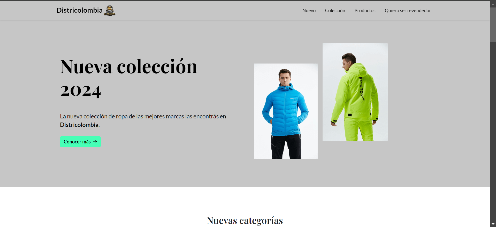
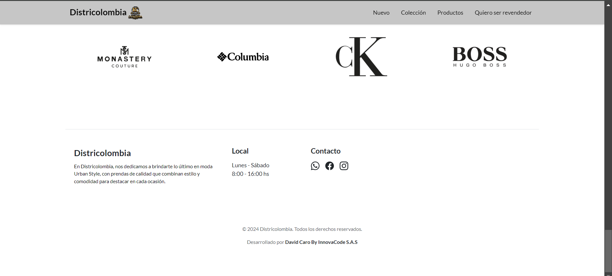

# Districolombia - Landing Page Oficial

**Diseño adaptado por David Caro, InnovaCode S.A.S**

Districolombia es una tienda de ropa estilo urban que combina calidad, tendencia y cultura urbana en sus prendas. Nuestra landing page ha sido diseñada con el propósito de brindar una experiencia de usuario fluida, destacando nuestros productos más recientes y facilitando el contacto directo para solicitudes y ventas a través de WhatsApp.

## 🎨 Inspiración del Diseño
La estructura y diseño visual están inspirados en conceptos innovadores de la web de Rumanía, pero adaptados para transmitir el estilo único y fresco de la moda urbana colombiana. La paleta de colores, tipografía y disposición de los elementos están pensados para ser visualmente atractivos y fáciles de navegar.

---

## 🛍️ Secciones Principales

### 1. **Nuevos Productos**
   - En esta sección se muestran los últimos productos añadidos a nuestro catálogo. Los clientes podrán ver lo más nuevo en nuestra línea de ropa urbana, con imágenes de alta calidad, descripciones y enlaces directos a la compra.

### 2. **Catálogo de Productos**
   - Una vista detallada de nuestras categorías y productos disponibles. Cada producto cuenta con una descripción detallada, precio y un enlace para solicitar el producto vía WhatsApp.

### 3. **Vinculación a WhatsApp**
   - Todos los productos están enlazados directamente a nuestra cuenta de WhatsApp para facilitar las consultas y pedidos personalizados. Los usuarios pueden hacer clic en el botón "Comprar en WhatsApp" y serán redirigidos para completar su compra directamente en su aplicación de mensajería.

### 4. **Formulario: Quiero ser Revendedor**
   - Para aquellos interesados en unirse a nuestro equipo de revendedores, hemos creado un formulario que permite postularse fácilmente. Los aspirantes pueden ingresar su nombre, apellido y número de celular para ser contactados directamente.

---

## 🖥️ Tecnologías Utilizadas

- **HTML5**: Para la estructura semántica del sitio.
- **CSS3**: Diseño responsivo y moderno utilizando estilos personalizados.
- **JavaScript**: Interactividad para mejorar la experiencia del usuario.
- **Bootstrap 5**: Diseño rápido y responsivo, con componentes reutilizables.
- **WhatsApp API**: Integración directa para facilitar las ventas y consultas por mensajería instantánea.
- **PHP**: Para el manejo de formularios de contacto y recolección de datos.

---

## 🚀 Características

- **Diseño Responsivo**: Totalmente adaptado para dispositivos móviles, tablets y desktops.
- **Carga Rápida**: Optimización de imágenes y archivos para una carga rápida en cualquier dispositivo.
- **Integración con WhatsApp**: Cada producto está vinculado a WhatsApp para una experiencia de compra instantánea.
- **Postulación para Revendedores**: Sección exclusiva para aquellos interesados en distribuir nuestros productos.

---

## 📋 Cómo usar

1. **Descargar o clonar el repositorio**:
   git clone https://github.com/caromoralesdavid/Districolombia.git

   📄 Licencia
Este proyecto está bajo la licencia MIT - ver el archivo LICENSE.md para más detalles.

📞 Contacto
Para más información sobre el proyecto o si deseas colaborar, puedes contactarme en:

David Caro: LinkedIn

